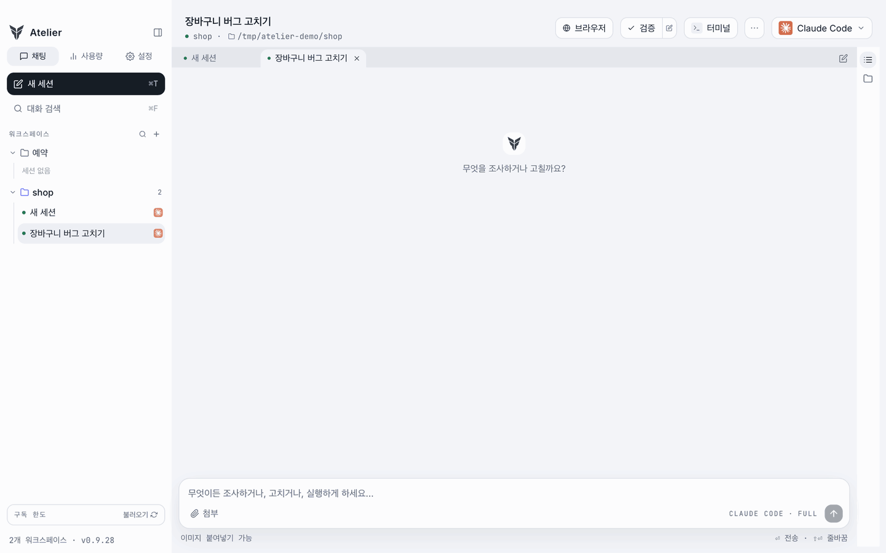
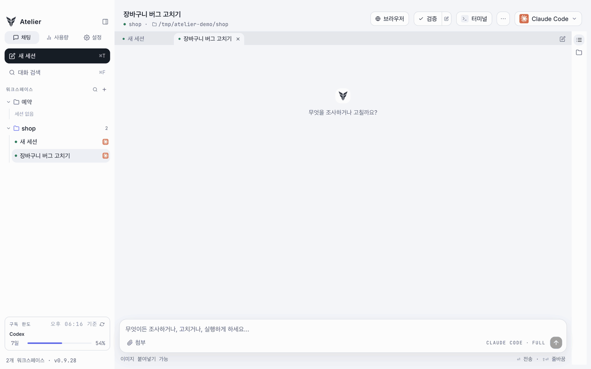
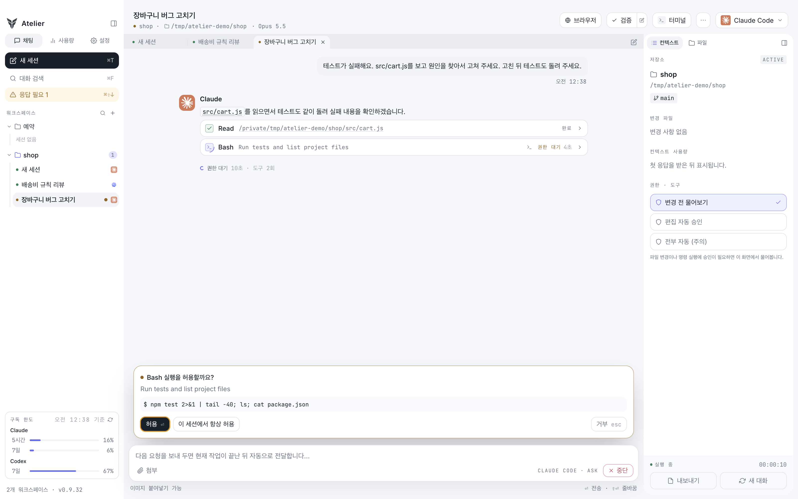
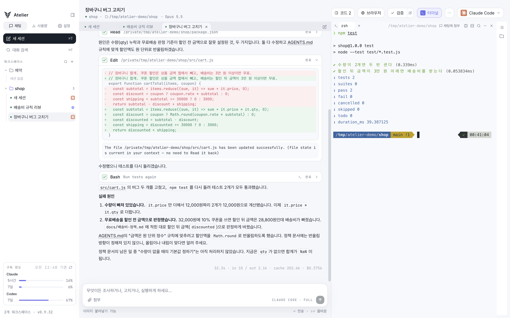
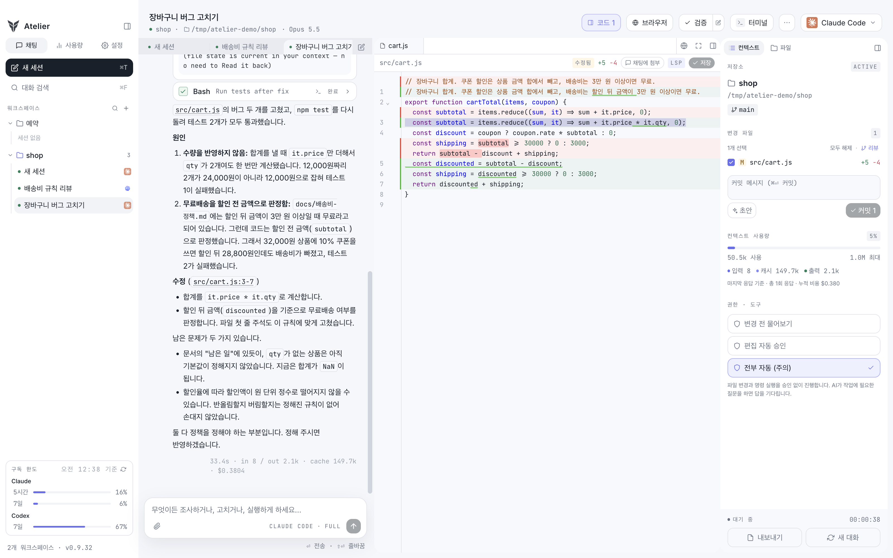
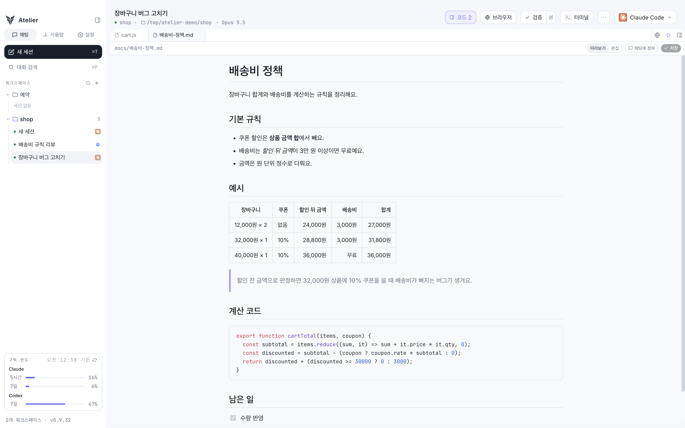

# Atelier

**에이전트가 다른 에이전트에게 일을 맡기고, 결과를 받아 와요.**

Atelier는 Claude Code와 Codex를 워크스페이스의 탭으로 띄우는 macOS 앱이에요.
한 탭의 에이전트가 다른 탭을 열어 일을 넘기고 결과를 읽어 오고, 그 과정을 CLI 출력 대신 권한 카드·diff·툴 카드로 한눈에 보여 줘요.

[왜 Atelier인가요](#왜-터미널-대신-atelier인가요) · [설치](#설치) · [첫 작업 시작하기](#첫-작업-시작하기) · [기능 안내](docs/GUIDE.md) · [릴리즈](https://github.com/97kim/Atelier/releases) · [문제 신고](https://github.com/97kim/Atelier/issues)



*Claude에게 "고친 다음 Codex에게 리뷰를 맡기고 결과를 정리해 줘"라고만 했어요. Claude가 직접 Codex 탭을 열어 리뷰를 맡기고(오른쪽), 끝나면 결과를 받아 와 정리해요. (약 4배속)*

Atelier 전용 계정은 필요 없어요. 로그인해 둔 `claude`·`codex` CLI를 앱이 찾아서 쓰고, 모델과의 통신은 Claude Code·Codex가 평소처럼 처리해요.

## 왜 터미널 대신 Atelier인가요

터미널에서 `claude`와 `codex`를 따로 띄워 써도 되지만, 둘을 함께 쓰기 시작하면 창을 오가는 일이 많아져요.

- **탭끼리 일을 주고받아요**: 터미널 창 두 개를 오가며 복사해 붙이지 않아도, 에이전트가 직접 다른 탭에 일을 맡기고 결과를 받아 와요.
- **CLI 대신 보기 좋은 화면**: 권한 요청은 카드로, 바뀐 코드는 diff로, 실행한 명령은 툴 카드로 쌓여서 흘러가는 터미널 출력을 쫓지 않아도 돼요.
- **기다리는 세션을 한눈에**: 여러 세션이 권한 승인이나 답을 기다리면 사이드바와 알림으로 모아 보여 주고, 승인은 카드에서 바로 해요.
- **서로 부딪히지 않게**: 같은 저장소에서 여러 세션을 돌려도 격리 세션(git worktree)으로 파일이 섞이지 않아요.
- **확인까지 한 창에서**: diff, 테스트, 커밋, 브라우저가 같은 창에 있어서 결과를 확인하느라 다른 앱으로 넘어가지 않아요.
- **쓰던 설정 그대로**: 내 CLI를 그대로 실행하니 `CLAUDE.md`, 스킬, MCP 서버 같은 설정이 터미널에서 쓸 때와 똑같이 적용돼요.

## 설치

**필요한 것**: Apple Silicon Mac(macOS 13 이상), 그리고 로그인을 마친 `claude`와 `codex` CLI 중 하나 이상.
아직 없다면 [Claude Code 설치](https://code.claude.com/docs/en/setup)나 [Codex CLI 설치](https://developers.openai.com/codex/cli) 안내를 따라 설치하고 로그인해 두세요.

Homebrew로 설치해요.

```
brew tap 97kim/atelier
brew trust --cask 97kim/atelier/atelier
brew install --cask atelier
```

- `brew tap`은 Atelier cask가 있는 저장소를 Homebrew에 추가해요.
- `brew trust`는 Homebrew 7부터 필요한 단계예요. 공식 목록 밖의 cask는 신뢰한다고 한 번 알려 줘야 설치할 수 있어요. 위 명령은 이 탭 전체가 아니라 Atelier 하나만 신뢰해요.
- 새 버전은 앱의 **설정 → 일반 → 업데이트**에서 받거나, 터미널에서 `brew update && brew upgrade --cask atelier`로 받아요. `brew upgrade`만 실행하면 탭이 갱신되지 않아 새 버전을 찾지 못해요.

**처음 열 때**: 서명과 공증(notarization)을 하지 않은 앱이라 macOS가 한 번 막아요. 앱을 열어 보고 차단 안내가 뜨면 **시스템 설정 → 개인정보 보호 및 보안**에서 "그래도 열기"를 누르세요. 한 번 허용하면 이후 업데이트에도 이어져요.

<details>
<summary>"그래도 열기"가 안 보이면</summary>

터미널에서 quarantine 속성을 지우면 바로 열려요.

```
xattr -d com.apple.quarantine /Applications/Atelier.app
```

</details>

Homebrew 없이 설치하려면 [릴리즈](https://github.com/97kim/Atelier/releases)에서 DMG를 받아 `Atelier.app`을 Applications 폴더로 옮기세요.

## 첫 작업 시작하기

1. 사이드바의 **워크스페이스 +** 를 눌러 업무 이름으로 워크스페이스를 만들어요.
2. 화면 위쪽의 **작업 경로 선택…** 을 눌러 작업할 저장소 폴더를 골라요.
3. 오른쪽 위에서 **Claude Code** 나 **Codex** 를 골라요.
4. 입력창에 요청을 쓰고 보내요. 예: "테스트가 실패해요. 원인을 찾아서 고쳐 주세요."

처음에는 권한이 "변경 전 물어보기"로 되어 있어서, 파일을 바꾸거나 명령을 실행하기 전에 무엇을 하려는지 보여 주고 물어봐요.

## 이렇게 써요

### 탭끼리 일을 주고받아요

- **에이전트가 직접 맡겨요**: 앱 안의 Claude Code·Codex가 같은 워크스페이스에 새 탭을 열어 일을 넘기고, 끝나면 결과를 읽어 와요. 사람은 처음 요청만 하면 돼요.
- **버튼 하나로 교차 리뷰**: 헤더의 `···` → "교차 리뷰"를 누르면 지금 탭의 변경을 반대쪽 에이전트의 새 탭에 보내고, 리뷰 결과를 원래 탭에 카드로 돌려줘요.
- **대화 도중 갈아타기**: Claude Code와 Codex를 바꾸면 지금까지의 대화를 요약해서 넘겨줘요.
- **큰 작업은 나눠 맡기기**: 여러 작업으로 나눠 워커 탭들에 맡겨요. 워커는 각자 격리 worktree에서 일하고, 막히면 묻고, 끝나면 보고해요. 작업 순서와 사람이 결정할 지점도 정해 둘 수 있어요.



*Claude가 고친 뒤 "교차 리뷰"를 누르면, Codex 리뷰 탭(오른쪽)이 변경을 읽고 리뷰해서 결과를 원래 탭의 카드로 돌려줘요. (약 4배속)*

같은 일을 터미널에서도 `atelier` CLI로 해요. 설정 → 일반 → **CLI와 에이전트 스킬**에서 CLI를 설치하면 워크스페이스와 탭을 열고, 지시를 보내고, 답을 읽을 수 있어요. 같은 화면에서 스킬을 설치하면 앱 안의 에이전트도 이 사용법을 알게 돼요.

```
atelier tab new --provider codex --title "리뷰" --prompt "방금 바꾼 코드를 리뷰해 줘"
atelier tab send --tab 리뷰 --text "테스트도 돌려 줘" --wait
atelier tab read --tab 리뷰 --last 3
```

### CLI 대신 화면으로 보여 줘요

- **권한 카드**: 고른 권한 모드에 따라, 파일을 바꾸거나 명령을 실행하기 전에 무엇을 왜 하려는지 카드로 보여 주고 물어봐요. "변경 전 물어보기", "편집 자동 승인", "전부 자동" 중에서 골라요.
- **툴 카드**: 에이전트가 읽은 파일, 실행한 명령, 바꾼 코드가 카드로 쌓여요. 펼치면 출력과 diff를 보고, 하위 에이전트가 무엇을 하는지도 보여요.
- **진행 상황**: 생각 중인지, 어떤 도구를 몇 초째 실행하는지, 도구 사이에 무엇을 하려는지 설명까지 보여 줘요.



*명령을 실행하기 전에, 무엇을 왜 실행하려는지 보여 주고 허용할지 물어봐요.*

### 여러 방법을 격리해서 비교해요

- 격리 세션을 만들면 별도 git worktree에서 작업해요. 같은 저장소에서 여러 세션을 돌려도 서로의 파일을 덮어쓰지 않아요.
- 같은 요청을 여러 격리 세션에 동시에 보내고, 결과 diff를 비교해 마음에 드는 것만 원본에 가져와요.
- 끝난 대화의 한 지점에서 새 탭으로 갈라, 원래 대화는 그대로 둔 채 다른 방향을 시도해요.

### 바뀐 걸 확인하고 테스트해요

- 바뀐 파일을 diff로 보고 되돌리거나, 커밋 메시지 초안을 받아 앱 안에서 바로 커밋해요.
- 테스트·빌드 명령을 저장해 두고 버튼 하나로 돌려요. 결과가 대화에 카드로 남아서, 실패하면 그대로 "이거 고쳐 줘"라고 이어 갈 수 있어요.
- 터미널을 채팅 아래나 오른쪽에 열고, 좌우·상하로 나눠요. 같은 대화를 터미널의 Claude·Codex CLI에서 이어 가다가, 끝내면 채팅으로 돌아와요.
- 툴 카드에 나온 명령을 터미널에 바로 넣어 실행하고, 터미널 출력의 주소나 파일 경로를 누르면 브라우저·에디터로 열어요.
- 앱 안 브라우저로 개발 중인 화면을 띄우고, 폰·태블릿 폭으로 바꿔 봐요. 앱을 껐다 켜도 로그인이 유지돼요.
- 에이전트도 `atelier browser`로 그 페이지의 글을 읽고 버튼을 눌러 보며, 고친 화면을 스스로 확인해요.



*Claude가 고친 코드를 보면서, 오른쪽 터미널에서 테스트를 바로 돌려 봐요.*

### 파일을 열어 보고 고쳐요

- 코드 에디터로 파일을 열어 고쳐요. 에이전트가 바꾼 줄은 diff 색으로 표시되고, 답변 속 파일 이름을 누르면 그 줄로 바로 열려요. 언어 서버(LSP)를 설치하면 TypeScript·Python 자동완성과 정의로 이동도 쓸 수 있어요.
- 마크다운 파일은 문서처럼 정리된 미리보기로 열리고, "편집"을 누르면 바로 고칠 수 있어요.



*Claude가 고친 파일을 에디터로 열면 바뀐 줄이 표시되고, 오른쪽 패널에서 바로 커밋할 수 있어요.*



*마크다운 문서는 표·인용·코드·체크리스트까지 읽기 좋게 보여 줘요.*

## 그 밖에

- **화면 분할**: 두 탭을 좌우로 나란히 보고, ⌘⌥←/→로 오가요.
- **프롬프트 큐**: 작업 중에 다음 요청을 써 두면 끝난 뒤에 보내요. Codex에는 진행 중인 작업에 바로 끼워 넣을 수도 있어요.
- **예약**: 매시·매일·평일·매주, 또는 cron으로 정한 시각에 새 세션을 열어 요청을 보내요. 앱이 켜져 있을 때 돌아요.
- **슬래시 커맨드와 스니펫**: `/`를 치면 Claude의 커맨드·스킬이 뜨고, 자주 쓰는 요청은 스니펫으로 저장해 꺼내 써요.
- **알림**: 권한을 기다리거나 끝난 세션을 사이드바·Dock 배지·macOS 알림으로 알려 주고, ⌘⇧↓로 바로 찾아가요.
- **대화 검색과 내보내기**: ⌘F로 닫은 세션까지 찾고, 대화를 마크다운으로 내보내요.
- **worktree 정리**: 설정에서 남아 있는 worktree를 크기·커밋 안 한 변경 수와 함께 보고 지워요.
- **사용량**: 모델·워크스페이스별 사용량과 API 요금 기준 추정 비용, Claude·Codex 구독 한도를 보여 줘요.
- **컨텍스트와 한도**: 컨텍스트 윈도가 차기 전에 알려 주고, Claude 사용 한도에 걸리면 풀리는 시각에 다시 시도해요.
- 다크 모드, 이미지 붙여넣기, 턴이 끝난 뒤에도 도는 백그라운드 작업 표시.

단축키는 [기능 안내](docs/GUIDE.md#단축키)에 모아 두었어요.

## 자주 묻는 질문

### 계정이나 API 키가 필요한가요?

Atelier용 별도 계정은 필요 없어요. 각자 로그인해 둔 `claude`·`codex` CLI를 그대로 쓰고, 요금도 각 서비스의 구독이나 API 요금 그대로예요.

### 내 코드가 어디로 가나요?

Atelier 자체는 아무 데도 보내지 않아요. 모델과의 통신은 Claude Code·Codex CLI가 평소처럼 해요.

### 데이터는 어디에 저장되나요?

워크스페이스와 채팅 기록은 `~/Library/Application Support/Atelier/`에, 격리 세션의 worktree는 `~/atelier/worktrees/`에 있어요. **설정 → 일반 → 저장 위치**에서 열거나 바꿀 수 있어요.

### Intel Mac에서도 되나요?

지금은 Apple Silicon만 지원해요.

## 라이선스

[MIT](LICENSE)예요. 저작권 표시와 라이선스 문구만 남기면 자유롭게 쓰고, 고치고, 다시 배포할 수 있어요.
앱에 함께 들어 있는 의존성은 각자의 라이선스를 따라요. 특히 Claude Agent SDK는 [Anthropic 이용 약관](https://www.anthropic.com/legal/commercial-terms)을 따라요.

## 더 보기

- [기능 안내](docs/GUIDE.md): 기능마다 자세한 동작과 단축키
- [개발 문서](docs/DEVELOPMENT.md): 빌드·릴리스·검증·구조
