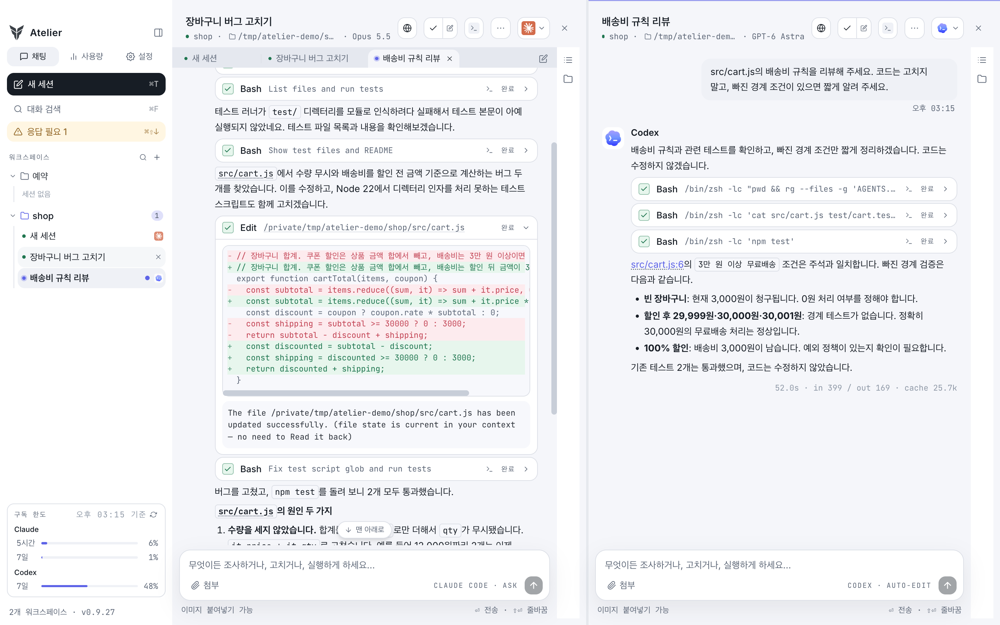

# Atelier

**Claude에게 고치게 하고 Codex에게 리뷰를 받아요.**

Atelier는 Claude Code와 Codex를 탭으로 띄워 함께 일하는 macOS 앱이에요.
코드 수정부터 diff 확인, 테스트, 커밋까지 한곳에서 이어 가요.

[설치](#설치) · [첫 작업 시작하기](#첫-작업-시작하기) · [기능 안내](docs/GUIDE.md) · [릴리즈](https://github.com/97kim/Atelier/releases) · [문제 신고](https://github.com/97kim/Atelier/issues)



*왼쪽에서 Claude가 버그를 고치고, 오른쪽에서 Codex가 빠진 경계 조건을 짚어요.*

Atelier 전용 계정은 필요 없어요. 로그인해 둔 `claude`·`codex` CLI를 앱이 찾아서 쓰고, 모델과의 통신은 Claude Code·Codex가 평소처럼 처리해요.

## 설치

**필요한 것**: Apple Silicon Mac(macOS 13 이상), 그리고 로그인을 마친 `claude`와 `codex` CLI 중 하나 이상.

Homebrew로 설치해요.

```
brew tap 97kim/atelier
brew trust --cask 97kim/atelier/atelier
brew install --cask atelier
```

- `brew tap`은 Atelier 설치 레시피가 있는 저장소를 Homebrew에 추가해요.
- `brew trust`는 Homebrew 7부터 필요한 단계예요. 공식 목록 밖의 레시피는 신뢰한다고 한 번 알려 줘야 설치할 수 있어요. 위 명령은 이 탭 전체가 아니라 Atelier 하나만 신뢰해요.
- 새 버전은 `brew upgrade --cask atelier`로 받아요.

**처음 열 때**: 서명과 공증을 하지 않은 앱이라 macOS가 한 번 막아요. 앱을 열어 보고 차단 안내가 뜨면 **시스템 설정 → 개인정보 보호 및 보안**에서 "그래도 열기"를 누르세요. 한 번 허용하면 이후 업데이트에도 이어져요.

<details>
<summary>"그래도 열기"가 안 보이면</summary>

터미널에서 격리 표시를 떼면 바로 열려요.

```
xattr -d com.apple.quarantine /Applications/Atelier.app
```

</details>

Homebrew 없이 설치하려면 [릴리즈](https://github.com/97kim/Atelier/releases)에서 DMG를 받아 `Atelier.app`을 Applications 폴더로 옮기세요.

## 첫 작업 시작하기

1. 사이드바의 **워크스페이스 +** 를 눌러 업무 이름으로 워크스페이스를 만들어요.
2. 화면 위쪽의 **작업 경로 선택…** 을 눌러 작업할 저장소 폴더를 골라요.
3. 오른쪽 위에서 **Claude Code** 나 **Codex** 를 골라요.
4. 입력창에 요청을 쓰고 보내요. 예: "테스트가 실패해요. 원인을 찾아서 고쳐 주세요."

처음에는 권한이 "변경 전 물어보기"로 되어 있어서, 파일을 바꾸거나 명령을 실행하기 전에 무엇을 하려는지 보여 주고 물어봐요.

## 이렇게 써요

### 한쪽이 고치고, 다른 쪽이 리뷰해요

- 탭마다 Claude Code나 Codex를 골라요. 대화 도중에 바꾸면 지금까지의 내용을 요약해서 넘겨줘요.
- 화면을 좌우로 나눠 두 탭을 나란히 보고, ⌘⌥←/→로 오가요.
- 한쪽이 바꾼 코드를 다른 쪽 새 탭에 보내 독립적인 리뷰를 받아요.
- 고른 권한 모드에 따라 파일 변경과 명령 실행 전에 승인을 요청해요. "변경 전 물어보기", "편집 자동 승인", "전부 자동" 중에서 골라요.


*명령을 실행하기 전에, 무엇을 왜 실행하려는지 보여 주고 허용할지 물어봐요.*

### 여러 방법을 격리해서 비교해요

- 격리 세션을 만들면 별도 git worktree에서 작업해요. 같은 저장소에서 여러 세션을 돌려도 서로의 파일을 덮어쓰지 않아요.
- 같은 요청을 여러 격리 세션에 동시에 보내고, 결과 diff를 비교해 마음에 드는 것만 원본에 가져와요.
- 끝난 대화의 한 지점에서 새 탭으로 갈라, 원래 대화는 그대로 둔 채 다른 방향을 시도해요.

### 바뀐 걸 확인하고 테스트해요

- 바뀐 파일을 diff로 보고 되돌리거나, 커밋 메시지 초안을 받아 앱 안에서 바로 커밋해요.
- 테스트·빌드 명령을 저장해 두고 버튼 하나로 돌려요. 결과가 대화에 카드로 남아서, 실패하면 그대로 "이거 고쳐 줘"라고 이어 갈 수 있어요.
- 터미널을 채팅 아래나 오른쪽에 열고, 좌우·상하로 나눠요. 같은 대화를 터미널의 Claude·Codex CLI에서 이어 가다가, 끝내면 채팅으로 돌아와요.
- 도구 카드에 나온 명령을 터미널에 바로 넣어 실행하고, 터미널 출력의 주소나 파일 경로를 누르면 브라우저·에디터로 열어요.
- 코드 에디터로 파일을 열어 고쳐요. 답변 속 파일 이름을 누르면 그 줄로 바로 열려요. 언어 서버를 설치하면 TypeScript·Python 자동완성과 정의로 이동도 쓸 수 있어요.
- 앱 안 브라우저로 개발 중인 화면을 띄우고, 폰·태블릿 폭으로 바꿔 봐요. 앱을 껐다 켜도 로그인이 유지돼요.
- 에이전트도 `atelier browser`로 그 페이지의 글을 읽고 버튼을 눌러 보며, 고친 화면을 스스로 확인해요.


*Claude가 고친 코드를 보면서, 오른쪽 터미널에서 테스트를 바로 돌려 봐요.*

## 명령줄로 조종하고, 일을 나눠 맡겨요

설정 → 일반에서 명령줄 도구를 설치하면 `atelier` 명령으로 실행 중인 앱을 다뤄요. 워크스페이스와 탭을 열고 닫고, 지시를 보내고, 답을 읽어요.
같은 화면에서 스킬을 설치하면 Claude Code·Codex가 사용법을 알게 돼서, 앱 안의 에이전트가 새 탭을 열어 일을 넘기거나 다른 탭의 결과를 읽어 와요.

```
atelier tab new --provider codex --title "리뷰" --prompt "방금 바꾼 코드를 리뷰해 줘"
atelier tab send --tab 리뷰 --text "테스트도 돌려 줘" --wait
atelier tab read --tab 리뷰 --last 3
```

큰 작업은 여러 작업으로 나눠 워커 탭들에 맡길 수 있어요. 워커는 각자 격리 worktree에서 일하고, 막히면 묻고, 끝나면 보고해요.
작업 사이의 순서와 사람이 결정할 지점을 정해 둘 수 있고, 진행을 지휘하는 역할은 사람이나 Claude·Codex 탭이 맡아요. 자세한 사용법은 [기능 안내](docs/GUIDE.md)에 있어요.

## 그 밖에

- **대기열**: 작업 중에 다음 요청을 써 두면 끝난 뒤에 보내요. Codex에는 진행 중인 작업에 바로 끼워 넣을 수도 있어요.
- **예약**: 매시·매일·평일·매주, 또는 cron으로 정한 시각에 새 세션을 열어 요청을 보내요. 앱이 켜져 있을 때 돌아요.
- **슬래시 커맨드와 스니펫**: `/`를 치면 Claude의 커맨드·스킬이 뜨고, 자주 쓰는 요청은 스니펫으로 저장해 꺼내 써요.
- **알림**: 권한을 기다리거나 끝난 세션을 사이드바·Dock 배지·macOS 알림으로 알려 주고, ⌘⇧↓로 바로 찾아가요.
- **대화 검색과 내보내기**: ⌘F로 닫은 세션까지 찾고, 대화를 마크다운으로 내보내요.
- **worktree 정리**: 설정에서 남아 있는 worktree를 크기·커밋 안 한 변경 수와 함께 보고 지워요.
- **사용량**: 모델·워크스페이스별 사용량과 API 요금 기준 추정 비용, Claude·Codex 구독 한도를 보여 줘요.
- **컨텍스트와 한도**: 컨텍스트 창이 차기 전에 알려 주고, Claude 사용 한도에 걸리면 풀리는 시각에 다시 시도해요.
- 다크 모드, 이미지 붙여넣기, 턴이 끝난 뒤에도 도는 백그라운드 작업 표시.

단축키는 [기능 안내](docs/GUIDE.md#단축키)에 모아 두었어요.

## 자주 묻는 질문

### 계정이나 API 키가 필요한가요?

Atelier용 별도 계정은 필요 없어요. 각자 로그인해 둔 `claude`·`codex` CLI를 그대로 쓰고, 요금도 각 서비스의 구독이나 API 요금 그대로예요.

### 내 코드가 어디로 가나요?

Atelier 자체는 아무 데도 보내지 않아요. 모델과의 통신은 Claude Code·Codex CLI가 평소처럼 해요.

### 데이터는 어디에 저장되나요?

워크스페이스와 채팅 기록은 `~/Library/Application Support/Atelier/`에, 격리 세션의 worktree는 `~/atelier/worktrees/`에 있어요. **설정 → 일반 → 저장 위치**에서 열거나 바꿀 수 있어요.

### Intel Mac에서도 되나요?

지금은 Apple Silicon만 지원해요.

## 라이선스

소스 코드는 누구나 볼 수 있게 공개했지만, 오픈소스 라이선스를 붙이지 않았어요. 모든 권리는 97kim에게 있어요.
GitHub 이용 약관이 허락하는 범위(GitHub 안에서 보기·포크) 말고는, 허락 없이 코드를 복제하거나 고쳐서 배포할 수 없어요.
앱은 [릴리즈](https://github.com/97kim/Atelier/releases)나 Homebrew로 받아 자유롭게 쓰면 돼요.

## 더 보기

- [기능 안내](docs/GUIDE.md): 기능마다 자세한 동작과 단축키
- [개발 문서](docs/DEVELOPMENT.md): 빌드·릴리스·검증·구조
